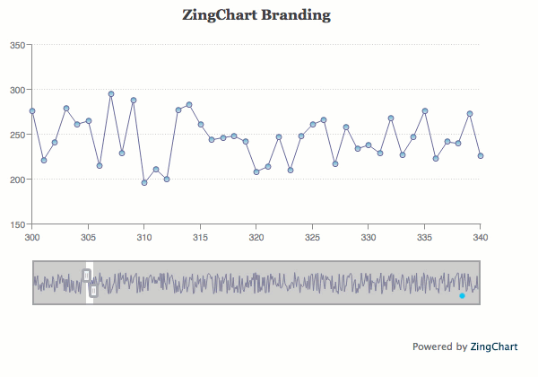
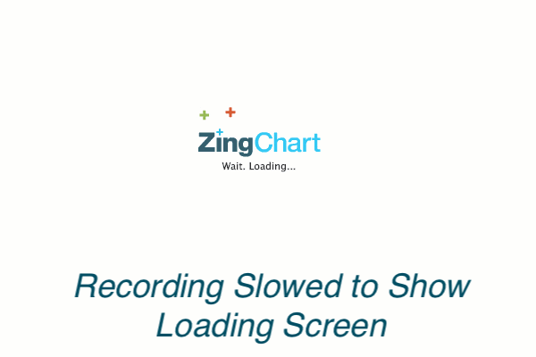

# Custom Charts

So you’ve decided to buy ZingChart and make our charts part of your app or website. Congratulations! Now we can help you take your custom charts to the next level. We’re sharing information on how to make your charts match your company’s branding even more closely.

ZingChart offers granular styling for nearly every chart element. This allows you to customize charts in very detailed ways. For example, you can match colors and other branding elements from your company. Our JSON syntax does a great job of laying out exactly what can be customized and how, in terms of chart elements.

But ZingChart allows more customization beyond colors and sizing.

## Custom Charts: Options

### Watermark

The ZingChart logo appears as a watermark at the bottom-right corner of our charts. It appears by default on all unlicensed charts when loaded into the web browser.

To remove the ZingChart logo watermark, you will need to buy a license key. Once you have your license key, set it in the `ZC.LICENSE` variable, e.g., 
`ZC.LICENSE = ["569d52cefae586f634c54f86dc99e6a9"]`.

If you still see the watermark, make sure the key is placed before the render method. Also, double check that it is placed in every page that renders charts.

### Custom Chart Context Menu
In ZingChart, users can right-click on a chart to access a menu of extra options. We call this the context menu. By default, “About ZingChart” appears as the last item in the menu on all unlicensed charts. You’ll see this when your chart is loaded into the web browser.

You need to buy a license key to remove the About ZingChart item that appears at the bottom of the context menu. Once you have your license key, set it in the `ZC.LICENSE` variable. For example, `ZC.LICENSE = ["569d52cefae586f634c54f86dc99e6a9"]`.

Besides removing “About ZingChart,” we offer more options for customizing the chart context menu.
* Pre-existing context menu options can be removed
* Custom options can also be added

Customizing the context menu in your charts involves adding code beyond the standard chart JSON. Full details are available in the [context menu docs page](http://www.zingchart.com/docs/interactive-charts/customizing-context-menu/).

One popular option is to add your own item. Use the “custom-items” array to define custom context menu items. Custom items will execute your own JavaScript functions when clicked.

### Custom Loading Screen

The loading screen is what users see before a chart appears on the page. It is generally only visible with larger data sets, when the page needs more time for the chart to fully load. By default, the ZingChart logo appears on that screen. Users have the option of removing it or replacing it with a different image.

To remove or hide the ZingChart logo, go to the render method. Add a hideprogresslogo attribute, and set the value to true.

To add your own logo, go to the render method. Add a `customprogresslogo` attribute, and provide an image URL, e.g., `customprogresslogo: 'http://www.zingchart.com/images/blueberry.jpg'`.


zingchart.render({
  id : 'myChart',
  data : myConfig,
  height: 400,
  width: 600,
  customprogresslogo: 'http://www.zingchart.com/images/blueberry.jpg'
});


For all the details on updating your branding, check out our documentation on this topic at: http://www.zingchart.com/docs/getting-started/removing-zingchart-branding/